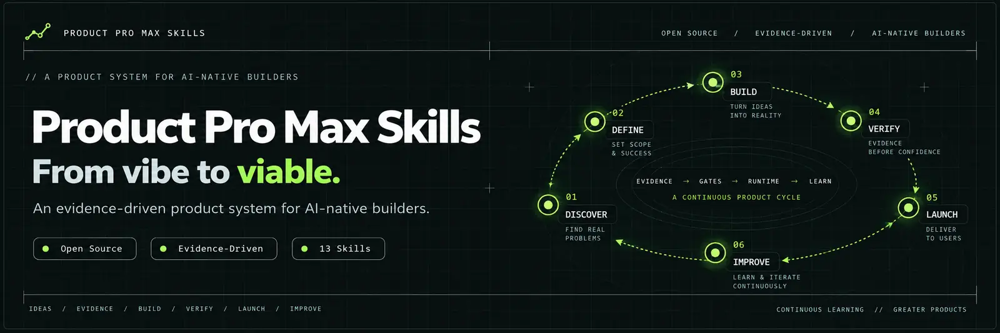

# Product Pro Max Skills

<p align="center">
  
</p>

<p align="center"><strong>From vibe to viable.</strong></p>

<p align="center">
  An open-source, evidence-driven product operating system for AI-native builders.
</p>

<p align="center">
  <a href="https://github.com/sonhoang23/product-pro-max-skills/stargazers"></a>
  <a href="./LICENSE"></a>
  <a href="./registry/skills.json"></a>
  <a href="./requirements-registry.txt"></a>
</p>

<p align="center">
  <a href="./PRODUCT-MODEL.md">Product Model</a> ·
  <a href="./README.vi.md">Tiếng Việt</a> ·
  <a href="./CONTRIBUTING.md">Contributing</a> ·
  <a href="./CONSTITUTION.md">Constitution</a>
</p>

## Why

AI can turn an idea into deployed software in hours. That does not mean the software solves a real problem, is safe to operate, is usable, can reach customers, retain them, or become a viable business.

Product Pro Max Skills helps builders move from:

**Idea → Evidence → Decision → Product → Verification → Distribution → Users → Revenue → Learning**

instead of:

**Idea → Prompt → Code → Deploy**

The system is intentionally opinionated:

- evidence before confidence;
- verification before "done";
- users before features;
- distribution is part of the product;
- learning continues after launch;
- STOP, PIVOT, DEFER, BACKTRACK and other evidence-driven decisions are valid outcomes.

## Canonical Product Model

Shared lifecycle semantics have one machine-readable authority:

**[`model/product-model.json`](./model/product-model.json)**

The human-readable contract is **[`PRODUCT-MODEL.md`](./PRODUCT-MODEL.md)**.

README pages, schemas, workflows, examples, diagrams, and translations are derived views. They must not invent or redefine canonical lifecycle identifiers.

The lifecycle is organized as:

```text
PRODUCT LIFECYCLE
    ↓
CYCLES
    ↓
PHASES

TRACKS     cross-cut disciplines
LOOPS      repeat learning or operating motions
GATES      judge evidence/readiness
DECISIONS  choose what happens next
```

Canonical cycles:

| Cycle | Purpose |
| --- | --- |
| Opportunity | Explore problems and evidence worth pursuing |
| Product Strategy | Choose market, customer, positioning, and business direction |
| Product Definition | Turn strategy into bounded, measurable product intent |
| Delivery | Design, plan, build, and integrate |
| Verification | Establish runtime, quality, security, reliability, and usability evidence |
| Go-to-Market | Prepare and expose the product to intended users |
| Growth | Acquire, activate, monetize, retain, refer, and expand |
| Operations | Operate, support, optimize, and maintain |
| Learning & Evolution | Review evidence and revise strategy or portfolio choices |
| End of Life | Deprecate, migrate, and sunset safely |

The complete canonical phase IDs and relationships live in the Product Model, not in this README.


### Lifecycle navigation order

Numbers below are for README navigation only, following the cycle order in `model/product-model.json`. Canonical IDs, directory names and registry paths remain unchanged.

| Order | Cycle |
| --- | --- |
| 01 | `opportunity` |
| 02 | `product-strategy` |
| 03 | `product-definition` |
| 04 | `delivery` |
| 05 | `verification` |
| 06 | `go-to-market` |
| 07 | `growth` |
| 08 | `operations` |
| 09 | `learning-evolution` |
| 10 | `end-of-life` |

## Core operating primitive

Every useful step should move through the same primitives:

```text
SKILL
  ↓
ARTIFACT
  ↓
EVIDENCE
  ↓
GATE
  ↓
DECISION
```

A generated document is not progress by itself. Progress exists when an artifact changes a decision and the evidence behind that decision is visible.

For experimentation-heavy work:

```text
ASSUMPTION
   ↓
HYPOTHESIS
   ↓
EXPERIMENT
   ↓
EXPOSURE
   ↓
MEASUREMENT
   ↓
EVIDENCE
   ↓
GATE
   ↓
DECISION
```

## Gates and decisions

Gate results and decisions are intentionally different.

Canonical gate results:

- `pass`
- `warn`
- `fail`

Canonical decisions include:

- `continue`
- `research`
- `revise`
- `pivot`
- `repeat`
- `backtrack`
- `defer`
- `stop`
- `escalate`

A `warn` gate, for example, might lead to `continue`, `research`, or `revise` depending on context. See [Product Model](./PRODUCT-MODEL.md).

## Current catalog — foundation only

**0 published/distributable skills.** The former 13 starter skills were demo/baseline material and have been withdrawn from `skills/`. Their implementation remains available in Git history and the historical Spec 002 migration inventory. Their former IDs are **not** available for invocation or installation.

The ten canonical cycle directories remain as placeholders. New skills will be added only after cycle/phase gap analysis, contract review, evidence and evaluation. There is no target count of skills.

The previous `idea-to-mvp`, `pre-launch-audit` and `idea-to-first-users` workflows are **inactive design references**. Their README files retain the original concept, but there are no executable `workflow.yaml` files. They must be rebuilt against accepted skills before activation.

See [Catalog reset](./docs/CATALOG-RESET.md) for scope and re-entry criteria.

## Install

Installation tooling is retained, but there are currently no published skills to install.

```bash
git clone https://github.com/sonhoang23/product-pro-max-skills.git
cd product-pro-max-skills
python scripts/install.py --target /path/to/project/.agents/skills --all --dry-run
```

While the catalog is empty, `--all` is a successful no-op. A named skill ID that has not been published is rejected. After skills are accepted, the same installer supports `--all` and `--skills ppmax-<slug>`.

## Use

No `ppmax-*` product skill is currently invocable from this repository. Use the canonical Product Model, contracts and project-state templates to develop and validate new skills. Do not use historical demo skill names as if they were installed.

## Project state

For long-running projects, keep durable product state outside chat history:

```text
.product-pro-max/
├── project.yaml       # cycle + phase + status
├── assumptions.yaml
├── evidence/
├── decisions/
├── artifacts/
└── passport.md
```

Canonical cycle, phase, and status values come from `model/product-model.json`.

Templates live in `templates/project-state/`.

## Quality bar

A skill is not accepted because its advice sounds smart. It must define scope, trigger, inputs, workflow, evidence rules, output contract, quality gate, stop conditions, anti-patterns and examples.

See:

- [Skill Contract](./SKILL-CONTRACT.md)
- [Evidence Model](./EVIDENCE-MODEL.md)
- [Quality Gates](./QUALITY-GATES.md)
- [Product Model](./PRODUCT-MODEL.md)

Repository validation checks structural skill requirements plus canonical Product Model drift in dependent schemas/templates.

## Canonical skill discovery

Distributable skills are organized by their **primary lifecycle cycle** at `skills/<primary-cycle>/ppmax-<slug>/`. Every skill has a `SKILL.md` behavioral contract and sibling `manifest.yaml` discovery metadata. Multi-cycle applicability is declared in the manifest rather than inferred from its folder.

`registry/skills.json` is generated from those manifests, not edited manually. Check drift with `python scripts/generate_skill_registry.py check`; install with the canonical `ppmax-` IDs using `scripts/install.py`. Repository-development tooling under `.agents/` is excluded.

## Repository structure

```text
skills/       Canonical distributable Agent Skills
workflows/    Composed product workflows
model/        Canonical shared product semantics
schemas/      Machine-readable contracts
templates/    Durable project-state templates
examples/     End-to-end examples
locales/      Stable terminology for localization
docs/         Architecture and guidance
scripts/      Dependency-free installation and validation
specs/        Spec Kit feature work and foundation backlog
.specify/     Spec Kit project workflow state/templates
.agents/      Repository-development skills and tooling
.github/      CI and contribution templates
```

`skills/` is product surface. `.agents/` is repository-development tooling; it is not automatically part of the distributable Product Pro Max skill catalog.

## Language

English is canonical for skill logic, shared product semantics, and machine identifiers. User-facing output should follow the user's preferred language.

Machine IDs such as `go-to-market`, `ppmax-runtime-verification`, `pass`, and `pivot` are not translated when used as contract values.

## Status

**Foundation development — catalog reset.** The canonical Product Model, manifest contract, derived registry and design system remain in place. Current catalog: **0 published skills / 0 executable workflows**. Historical Spec 002 acceptance evidence documents the former 13-skill baseline, not the current catalog.

## License

MIT.
